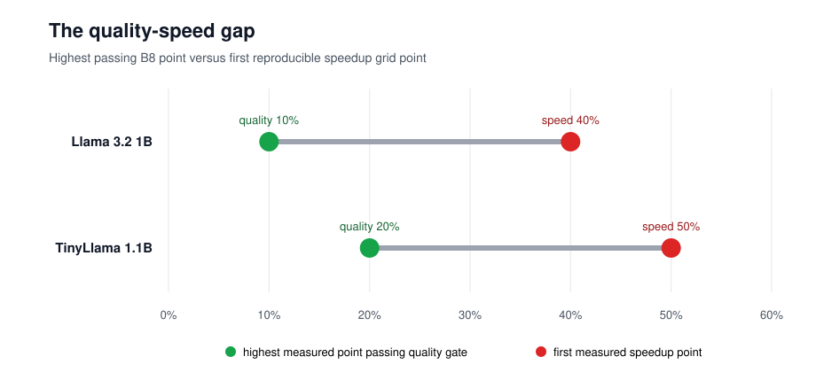
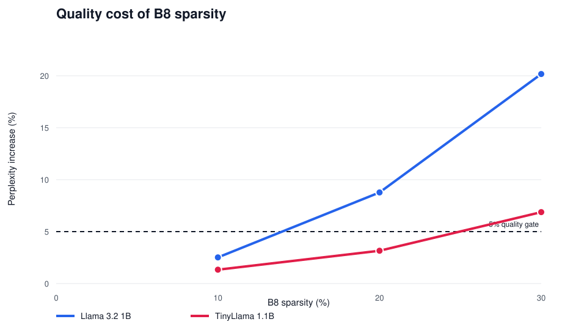
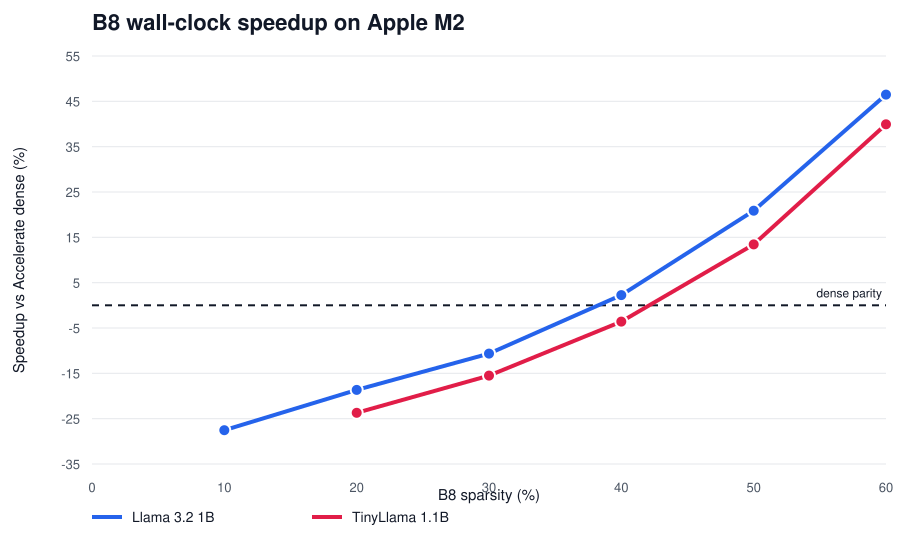

<div align="center">

# ARM-Sparse

### When fewer FLOPs do not mean faster inference

**A reproducible Apple M2 investigation into dynamic FFN block sparsity**


[Read the report](paper/arm-sparse-report.pdf) ·
[Reproduce the results](REPRODUCING.md) ·
[Read the technical story](docs/article.md) ·
[Audit the claims](research/package/claim-audit.md)

</div>

---

## The question

Large-language-model feed-forward networks perform thousands of neuron
calculations for every token. If many neurons contribute little for a specific
input, can we skip them and make inference faster?

The arithmetic suggests yes. CPU hardware makes the answer harder:

```text
theoretical sparsity
        │
        ├── fewer multiply-add operations
        │
        └── but also: indices + branches + scattered memory + weak SIMD
                                                        │
                                                        ▼
                                              speedup may disappear
```

ARM-Sparse tests a deliberate compromise:

> Compute a few unnecessary neurons inside contiguous blocks in exchange for
> packed weights, predictable memory access, simpler dispatch, and better CPU
> utilization.

The research question is therefore not *“Can neurons be removed?”* It is:

> **Can input-dependent FFN block sparsity preserve useful model quality and
> beat an optimized dense CPU baseline on Apple M2?**

## The answer

> [!IMPORTANT]
> **Not in the tested configuration.** Blocks accelerated the isolated FFN,
> but only at sparsity levels where model quality had already failed.



| Model | Highest measured B8 point passing quality | First measured B8 speedup point | Quality + speed overlap |
|:--|--:|--:|:--:|
| Llama 3.2 1B | **10%** | **40%** | ❌ No |
| TinyLlama 1.1B | **20%** | **50%** | ❌ No |

This distinction matters:

- **Yes:** packed B8 blocks can mechanically accelerate an FFN kernel.
- **No:** the tested models could not tolerate enough block sparsity to reach
  that acceleration region.
- **Not established:** deployable end-to-end sparse LLM acceleration.

This is a bounded negative result—not proof that every form of block sparsity
must fail.

## Why blocks looked promising

An irregular mask might select neurons like this:

```text
active neurons:  13, 18, 39, 54, 89, 101, ...
memory pattern:  jump → jump → jump → jump → jump
```

ARM-Sparse instead executes fixed contiguous groups:

```text
Block 37
├── gate rows       [8 × hidden]
├── up rows         [8 × hidden]
└── down columns    [hidden × 8]

selected once → packed once → reused across inference
```

The block executor performs additional arithmetic inside partially useful
groups, but replaces thousands of tiny decisions with regular execution units.
The experiment measures whether that trade wins in real wall-clock time.

## What was actually measured

<div align="center">
<table>
<tr>
<td align="center"><b>Quality experiment</b></td>
<td align="center"><b>Executor experiment</b></td>
</tr>
<tr>
<td>

Dense model<br>
↓<br>
Oracle contribution scores<br>
↓<br>
B8/B32 masks<br>
↓<br>
Relative perplexity

</td>
<td>

Recorded/favorable masks<br>
↓<br>
Packed native B8 kernel<br>
vs Accelerate dense<br>
↓<br>
Median wall-clock latency

</td>
</tr>
</table>
</div>

Keeping these paths separate prevents an oracle mask from being mislabeled as
a deployable selector. Selector cost is excluded from the runtime claims.

### Quality frontier



The preregistered gate allowed at most a **5% relative perplexity increase**.
Llama failed between 10% and 20% B8 sparsity; TinyLlama failed between 20% and
30%.

### Runtime frontier



The native FP32 B8 executor first beat Accelerate dense at the 40% measured
grid point for Llama geometry and at 50% for TinyLlama geometry. Exact
crossovers were not interpolated.

## The five experiments that decide the result

Eighteen experiments are retained, but only five carry the final conclusion:

| Experiment | Question | Verified observation |
|:--|:--|:--|
| **EXP-004** | How much B8 sparsity can Llama tolerate? | 10% passed (+2.520% perplexity); 20% failed (+8.773%). |
| **EXP-005** | Is the passing Llama point faster? | Real B8/10% replay masks were 37–39% slower than Accelerate dense. |
| **EXP-012** | Where does Llama-shaped B8 execution break even? | First positive grid point: 40%, with +1.6% to +3.1% across three runs. |
| **EXP-016** | Does the result generalize to TinyLlama? | B8 passed at 10% and 20%, then failed at 30%; B32 degraded faster. |
| **EXP-018** | Where does TinyLlama-shaped B8 break even? | First positive grid point: 50%, with +10.7% to +17.1% across three runs. |

The remaining experiments document mask expansion, scoring rules, neuron
reordering, hot/cold layouts, phase profiling, explicit NEON, run coalescing,
INT8 feasibility, llama.cpp Q8 baselines, and failed B32 paths. They remain in
the repository so the final narrative cannot hide negative evidence.

<details>
<summary><strong>What the result does—and does not—support</strong></summary>

### Supported

- Fixed contiguous blocks can cross optimized dense latency on Apple M2 when
  enough blocks are skipped.
- The tested unmodified Llama-family models lose acceptable quality before
  reaching that kernel break-even.
- Kernel optimization alone is unlikely to close the observed 30-percentage-
  point quality–speed gap.

### Not supported

- End-to-end token-generation speedup.
- A deployable low-cost sparsity selector.
- Generalization beyond the tested Apple M2.
- An impossibility claim about trained block-aware models.
- Novelty claims for contextual sparsity, neuron grouping, or weight packing.

</details>

## Reproduce the evidence

The committed result package can be validated without downloading either
model:

```bash
git clone https://github.com/sanjayy0612/sparsityARM.git
cd sparsityARM

python3 -m venv .venv
source .venv/bin/activate
pip install -e '.[dev,torch]'

make verify-package
```

The command:

1. validates the decisive manifests, hashes, provenance, numerical checks, and
   retained medians;
2. checks that the JSON, CSV, SVG figures, and LaTeX table match their source
   artifacts;
3. runs all **92 automated tests**.

To regenerate only the derived research package:

```bash
make package
```

See [REPRODUCING.md](REPRODUCING.md) for the exact measurement boundary.

## Experimental boundary

| Dimension | Recorded scope |
|:--|:--|
| Hardware | Apple M2 CPU, 8 GiB unified memory |
| Runtime | CPU-only, one thread, one-token FFN calls |
| Models | Llama 3.2 1B and TinyLlama 1.1B |
| Geometry | 2048→8192→2048 and 2048→5632→2048 SwiGLU |
| Primary kernel | Packed native FP32 B8 |
| Dense baseline | Apple Accelerate FP32 |
| Quality | 16 fixed WikiText-2 excerpts, 2,032 predicted tokens |
| Statistics | Per-run medians and three-run ranges—not confidence intervals |
| Selection | Oracle/replay masks; selector latency excluded |

## Repository guide

```text
arm-sparse/
├── armsparse/          Python correctness references and sparsity logic
├── cpp/                Native Apple M2 FFN executors
├── benchmarks/         Experiment runners
├── research/
│   ├── experiments/    Protocols and findings for EXP-001 … EXP-018
│   ├── results/        Committed measurement artifacts
│   ├── literature/     Verified primary-source records
│   ├── claims.yaml     Evidence-backed claim registry
│   └── package/        Generated summary and claim audit
├── research_tools/     Validators and deterministic packaging scripts
├── paper/              Canonical LaTeX, figures, tables, and PDF
└── tests/              Correctness and regression tests
```

### Start here

- **Fast overview:** [technical article](docs/article.md)
- **Complete argument:** [eight-page report](paper/arm-sparse-report.pdf)
- **Canonical manuscript:** [LaTeX source](paper/main.tex)
- **Exact numbers:** [machine-readable summary](research/package/summary.json)
- **Evidence mapping:** [claim audit](research/package/claim-audit.md)
- **Replication:** [reproduction guide](REPRODUCING.md)

## What should happen next?

The executor question has been answered for this configuration. Another local
kernel tweak would be research drift unless a new method can move the quality
frontier toward the measured **40–50%** speed region.

The strongest continuation is model–system co-design:

```text
train or reorganize for block-aligned activation
                    ↓
retain quality near 40–50% B8 sparsity
                    ↓
replay through the existing measured executor
                    ↓
only then build a deployable selector
```

## Prior work and positioning

ARM-Sparse is informed by DejaVu, LLM in a Flash, PowerInfer, PowerInfer-2,
Dynamic Input Pruning, and related contextual-sparsity systems. It does not
claim to invent contextual sparsity, neuron clusters, or contiguous access.
The defensible contribution is the controlled Apple M2 quality–latency
break-even investigation and its fully retained negative evidence.

## Research integrity

- Quantitative claims map to committed experiment artifacts.
- Literature statements map to verified primary sources.
- Hypotheses are not presented as observations.
- Failed experiments remain accessible.
- Oracle performance is never called deployable inference.
- Benchmark methodology is recorded and validated.

SOLARIS/Codex assisted with implementation, experiment execution, validation,
analysis, and writing. AI-generated prose is not treated as evidence.

---

<div align="center">

**Final result:** block sparsity worked as a high-sparsity kernel optimization,
but not as a quality-preserving LLM inference method under the tested setup.

</div>
